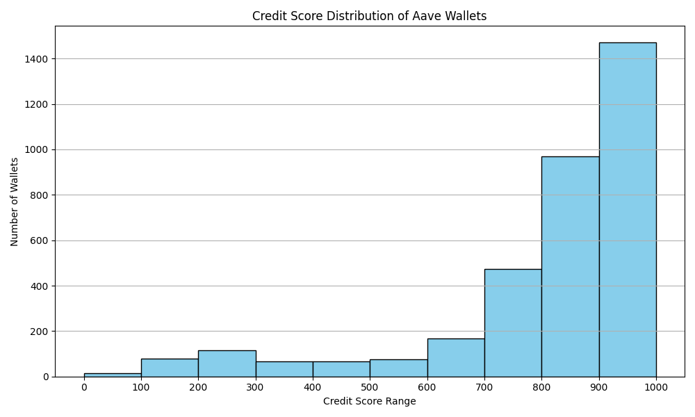

# Wallet Credit Score Analysis

This document presents an analysis of the credit scores assigned to wallets based on their historical transaction behavior on the Aave V2 protocol. The scores range from **0 to 1000**, with higher scores representing more responsible and safer user behavior, while lower scores indicate risky or exploitative patterns.

---

## 1. Score Distribution

The histogram above illustrates how wallet scores are distributed across the entire user base. A majority of users fall in the **600–900** range, suggesting overall responsible DeFi engagement. Very few users fall into the extremely low ranges (0–100), indicating rare but significant risk behaviors.

---

## 2. Score Bucket Summary
(0, 100]         15
(100, 200]       80
(200, 300]      117
(300, 400]       68
(400, 500]       68
(500, 600]       83
(600, 700]      157
(700, 800]      474
(800, 900]      973
(900, 1000]    1462

| Credit Score Range | Risk Level      | # Wallets | Observations |
|--------------------|-----------------|-----------|--------------|
| 0–100              | Very High Risk  |  🔴 15  | Frequent liquidations, high borrow/deposit ratios, short activity period |
| 100–300            | High Risk       |  🔶 197  | Some repayment issues, low deposit activity, signs of irregular use |
| 300–600            | Moderate Risk   |  🟡 219 | Inconsistent behavior, moderate engagement |
| 600–800            | Low Risk        |  🟢 631 | Balanced borrowing, regular deposits, rare liquidations |
| 800–1000           | Very Low Risk   |  🟢 2,435 | High deposit volumes, consistent repayment, active over time |

## 3. Behavioral Patterns by Score Range

🟥 Low Scores (0–300):
High borrow/deposit ratios (often > 0.8)

Multiple liquidationcall events

Minimal or no repay actions

Short lifespan of activity (few days active)

Potential bot-like or exploitative behavior

🟡 Mid Scores (400–700):
More balanced usage with moderate deposits and borrows

Fewer liquidation events

Some repayment behavior

Wallets may still be early or inactive in the protocol

🟢 High Scores (800–1000):
Active across all transaction types

Strong repayment history, no liquidations

High total deposits, low borrow-to-deposit ratio

Sustained activity over long periods

## 4. Feature Relationships
The credit scores exhibit intuitive relationships with key behavioral features:

| Feature                 | Correlation with Score | Insight                                     |
| ----------------------- | ---------------------- | ------------------------------------------- |
| Borrow-to-Deposit Ratio | 🔻 Negative            | Higher ratio = more risk                    |
| Number of Liquidations  | 🔻 Strong Negative     | More liquidations = lower score             |
| Days Active             | 🔺 Positive            | Long-term use = higher trust                |
| Total Deposits USD      | 🔺 Positive            | Larger, consistent deposits = more reliable |
| Avg Time Between Txns   | Variable               | Irregular timing may lower trust            |

## 5. Key Insights
🔐 Majority of wallets score between 600 and 900, reflecting healthy protocol usage patterns.

⚠️ Low scores (0–300) are clearly associated with behaviors such as frequent liquidation and low deposit volume.

✅ The score effectively captures risk-relevant patterns using engineered features, enabling DeFi protocols to assess user creditworthiness without relying on traditional identities or credit history.

This credit scoring system provides a scalable, data-driven way to enhance DeFi lending, reward design, and risk modeling — while remaining fully on-chain and transparent.